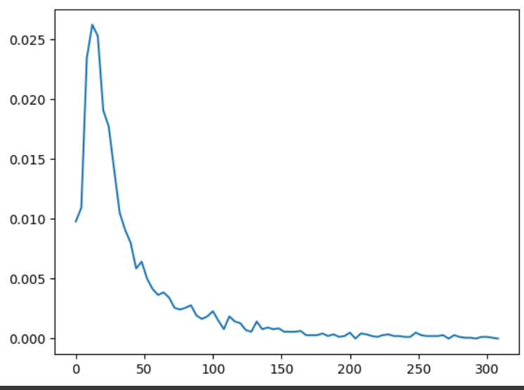
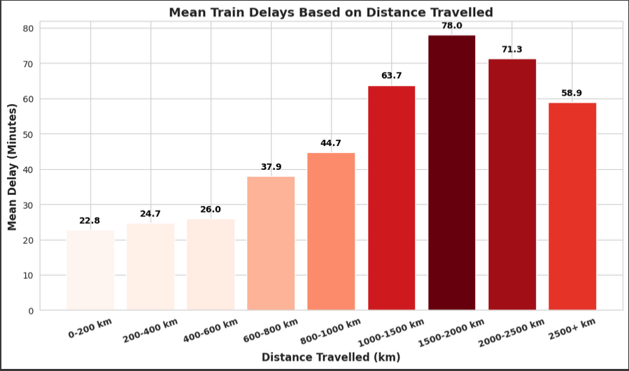
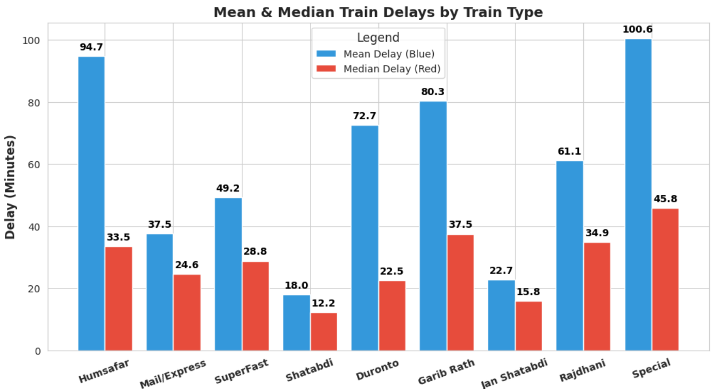
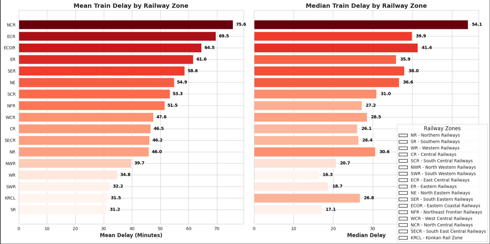
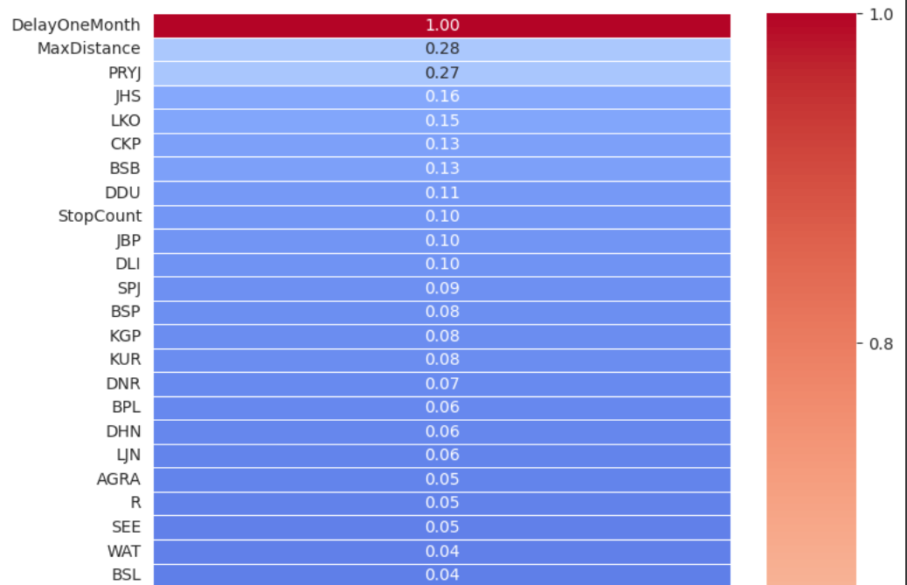
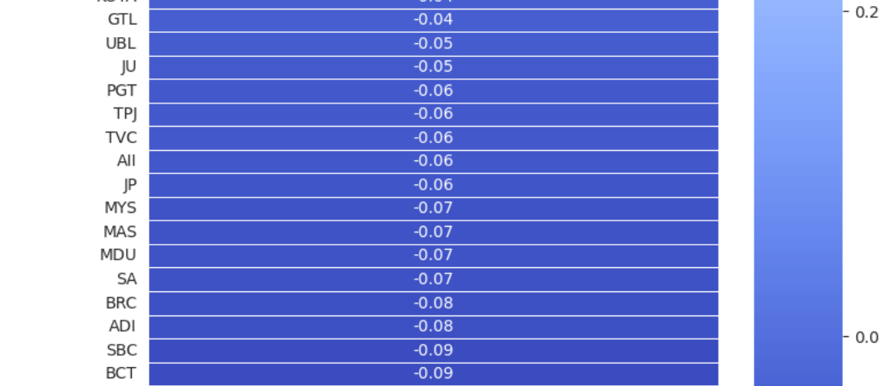

# Indian Railways Data Analysis

An interactive Streamlit web application for analyzing and visualizing Indian Railways data.  
The app provides insights into train delays, their correlation with distance, and other key factors through interactive charts and visualizations.

## 🚀 Live Demo
[Indian Railways Data Analysis](https://railway-analysis-madhuj.streamlit.app/)

## 📊 Features
- Visualizes train delays through various charts (delay distribution, correlation, etc.).
- Displays regression analysis and smoothened distribution graphs.
- User-friendly and interactive interface powered by Streamlit.

## 🛠️ Technologies Used
- **Python**: Backend logic and data processing.
- **Streamlit**: Interactive web application framework.
- **Matplotlib / Seaborn**: Data visualization.
- **Pandas / NumPy**: Data manipulation and analysis.

## 💻 Installation
```bash
git clone <your-repo-link>
cd Indian-Railways-Data-Analysis-main
pip install -r requirements.txt
streamlit run app.py
```

## 🖥️ Usage
- Open the Streamlit app in your browser.
- Interact with the charts to explore train delay patterns and trends.

## 🖼️ Screenshots
  
  
  
  
  
  


## 🛠️ Deployment
The project is deployed on Streamlit Community Cloud.

